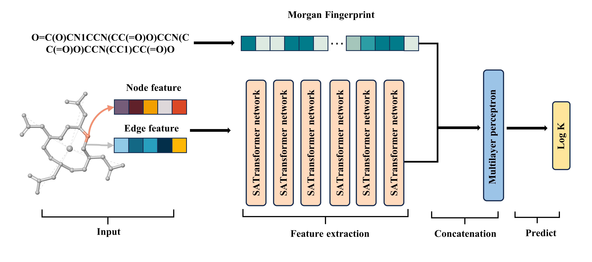

# Integrating Prior Chemical Knowledge into the Graph Transformer Network to Predict the Stability Constants of Chelating Agents with Radioactive Isotopes

#### The code originates from the article mentioned above. Here, we provide the complete training data, code, and results, which include various Graph Neural Network (GNN) baseline models, ablation study analyses, and interpretability analysis processes. 

####  SATCMF is specifically designed to predict the stability constants of chelating agents with radioactive isotopes.

## Framework



## Install Dependencies
SATCMF needs conda environment. After installing [conda](https://www.anaconda.com/),

1. `git clone https://github.com/chemprop/chemprop.git`
2. `cd SATCMF`
3. `conda env create -f environment.yml`
4. `conda activate SATCMF`


## Running 
### Data
To process the data with the provided script, you can use the following command structure
```
dataset/dataprocess.py --data_path <path> --save_fold_dir <dir> 
```
where `<path>` is the path to a CSV file containing a dataset,  and `<dir>` is the directory where model 10-fold checkpoints will be saved.
If you wish to add additional data, please format it according to the CSV file structure shown below. For example:
```
SMILES,Metal,LogK1
O=C(O)CN1CCN(CC(=O)O)CCN(CC(=O)O)CCN(CC(=O)O)CC1,Eu+++,26.21
O=C(O)CN1CCN(CC(=O)O)CCN(CC(=O)O)CCN(CC(=O)O)CC1,Gd+++,24.0
O=C(O)CN1CCN(CC(=O)O)CCN(CC(=O)O)CCN(CC(=O)O)CC1,Ce+++,24.6
...
```
### Train
To train a model with the provided script, you can use the following command structure:

`python train.py --data_path <path> --outdir <outdir> --gnn_type <gnn_type> --k_hop <k_hop> --use_fp_density_morgan` 

Here is the explanation of each parameter:

-   `--data_path <path>`: Specify the path to the CSV file that contains your dataset. Replace  `<path>`  with the actual file path.
-   `--outdir <outdir>`: Set the directory where the trained model and any output files will be saved. Replace  `<outdir>`  with the path to your desired output directory.
-   `--gnn_type <gnn_type>`: Choose the type of Graph Neural Network (GNN) to be used for updates. Replace  `<gnn_type>`  with the desired GNN architecture, such as GCN, GIN, GraphSAGE, or MPNN.
-   `--k_hop <k_hop>`: Define the number of hops to use when extracting subgraphs around each node. Replace  `<k_hop>`  with the number of hops you wish to consider.
-   `--use_fp_density_morgan`: Add this flag to enable the use of fingerprint density with the Morgan algorithm. This option is not enabled by default. If you want to activate this feature, simply include this flag in your command.

To train a model with the provided script, execute the following command in your terminal. For example:
```
python train.py --data_path "./dataset/10_fold_cv/fold10" --outdir "./SATCMF_train_result" --gnn_type "gcn" --k_hop "3" --use-fp-density
```

### Test
To predict the stability constants for new structures of metal chelators with different metal ions, follow these steps:

#### 1. Data Preparation
Before testing, you need to prepare your input data. Ensure that the input structures are in a CSV file format with the following columns: `SMILES`, `Metal`, `LogK1`. Here is an example of the expected format:
```
SMILES,Metal,LogK1  
O=C(O)CN1CCN(CC(=O)O)CCN(CC(=O)O)CCN(CC(=O)O)CC1,Lu+++,250
```
#### 2. Data Processing
Run the data processing script to prepare your test data:` 
```
python test/data_process.py --data_path <input_csv_path> --save_dir <processed_data_dir>
```
Parameters:
- `--data_path <input_csv_path>`: Path to the input data file in CSV format. Replace `<input_csv_path>` with the actual path to your data file.
- `--save_dir <processed_data_dir>`: Directory where the processed data will be saved. Replace `<processed_data_dir>` with the path where you want to save the processed data.

#### 3. Running the Test
After processing the data, you can run the test with the following command:`` 
```
python test/test.py --test_data_path <processed_data_path> --model_path <model_file_path> --output_path <predictions_csv_path>
```
Parameters:
- `--test_data_path <processed_data_path>`: Path to the processed test data file. Replace `<processed_data_path>` with the actual path to your processed data.
- `--model_path <model_file_path>`: Path to the trained model file. Replace `<model_file_path>` with the actual path to your trained model.
- `--output_path <predictions_csv_path>`: Path where the prediction output will be saved in CSV format. Replace `<predictions_csv_path>` with the path where you want to save the predictions.

Make sure to replace `<input_csv_path>`, `<processed_data_dir>`, `<processed_data_path>`, `<model_file_path>`, and `<predictions_csv_path>` with the appropriate paths for your files and directories.

For example:
```
python test/data_process.py --data_path "test_data.csv" --save_dir "./processed_test_data"  
python test/test.py --test_data_path "./processed_test_data/data_test.pt" --model_path "./test/SATCMF_gcn_K=3_model.pth" --output_path "./test/predictions.csv"
```

### Interpretability Analysis
If you want to perform interpretability analysis, follow these steps:

#### 1. Data Preparation
First, follow the data processing steps in the [Test](#test) section to prepare your data.

#### 2. Running the Interpretability Analysis
After processing the data, you can run the interpretability analysis with the following command:
```
python interpretation.py --graph-idx <graph_index> --outpath <output_path> --dataset-path <dataset_path> --model-path <model_path>
```
Parameters:
- `--graph-idx <graph_index>`: The index of the graph to interpret. Replace `<graph_index>` with the index of the graph you want to analyze.
- `--outpath <output_path>`: The output path for the visualization. Replace `<output_path>` with the path where you want to save the visualization.
- `--dataset-path <dataset_path>`: The path to the dataset file. Replace `<dataset_path>` with the actual path to your dataset.
- `--model-path <model_path>`: The path to the trained model file. Replace `<model_path>` with the actual path to your trained model.

Make sure to replace `<graph_index>`, `<output_path>`, `<dataset_path>`, and `<model_path>` with the appropriate values for your analysis.

For example:
```
python interpretation.py --visu --graph-idx 0 --outpath "./interpretation_analysis" --dataset-path "./interpretation_analysis/data_interpretation_DOTA_random_edge.pt" --model-path "./interpretation_analysis/SATCMF_gcn_K=3_model.pth"
```
In this example, we use DOTA for interpretability analysis. The attention score distribution graph will be saved in the specified `interpretation_analysis` directory.

### GNN Baseline Models
You can find the Graph Neural Network (GNN) baseline models in the `baseline_gnn_models` directory. 

## Results 
The results of the training are stored within their respective training folders. For detailed data analysis, please refer to the Jupyter notebooks provided in the corresponding directories.

Each training folder contains: 
- Trained model checkpoints 
- Logs of the training process 
- Performance metrics and evaluation results 

The Jupyter notebooks include:
- Data visualization 
- Performance analysis 
- Comparative studies with baseline models 

For a comprehensive understanding of the results and methodologies used, please explore the relevant folders and notebooks.

#### I would like to express my sincere gratitude to Dexiong Chen et al.for their exceptional work which has significantly contributed to the development of my project. The code used in this project is inspired by their innovative approach to graph representation learning, as presented in their paper "Structure-Aware Transformer for Graph Representation Learning," which was published in the proceedings of ICML 2022. Please find the original code and research paper at the following link:
>Dexiong Chen*, Leslie O'Bray*, and Karsten Borgwardt.
[Structure-Aware Transformer for Graph Representation Learning](https://arxiv.org/abs/2202.03036). ICML 2022.
<br/>*Equal contribution
